#  1. Getting Started

Markdown is a lightweight markup langguage that yoy can use to add formatting elements to plaintext text documents.Created by John Gruber in 2004.  

When you create a Markdown-formatted file, you add Markdown syntax to the text to indicate which words and phrases should look different. For instance,  
to denote a heading, you add a number sign before it (e.g., # Heading One). Or to make a phrase bold, you add two asterisks before and after it   
(e.g., **this text is bold** )

## Why use Markdown?

* Markdown can be used for everything. People use it to create websites, documents, notes, books, presentations, email, messages, and tech doc.
* Markdown is portable. Files containing Markdown-formatted text can be opened using virtually any application.
* Markdown is a platform independent. You can create Markdown-formatted text on any device running any OS.
* Markdown is future proof. Even if the application you're using stops working at some point in the future, you'll still be able to read your   
Markdown-formatted text using a text editing application.     
* Markdown is everywhere. Websites like Reddit and GitHub support Markdown, and lots of desktop and web-based applications support it.

## How Markdown Works

When you write in Markdown, the text is stored in a plaintext file that has an .md or .markdown extension. You need a Markdown application capable  
of processing the markdown file. there are lots of applications available.

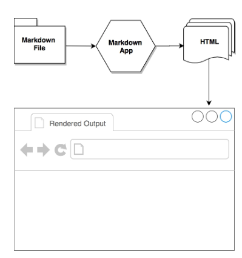

<div style="text-align:center">
   
</div>

<p align="center">
  
</p>

# 2. Doing things with Markdown

* Website
* Documents
* Notes
* Books
* Presentations
* Email
* Documentation

# 3. Basic Syntax

## Headings

To create a hading, add number signs (#) in front of a word or phrase. The number of number signs you use should correspond to the  
heading level. For example, to create a heading level three (<-h3>), three number signs.

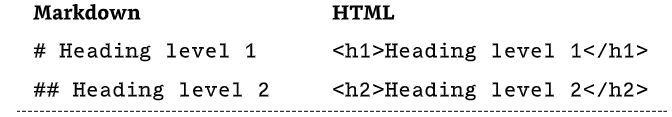


## Alternate Syntax
Alternatively, on the line below the text, add any number of == characters for heading level 1 or -- characters for heading level 2  

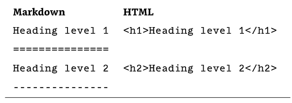

## Paragraphs

To create paragraphs, use a blank line to separate one or more lines of text.

I really like using Markdown.

I think I'll use it from now on.

## Line Breaks

To create a line break (<-br>), end a line with two or more spaces, and then type return.

this is the first line.  
And this is the second line.  

## Emphasis

### Bold

The bold text, add asterisks or underscores before and after a word or phrase.

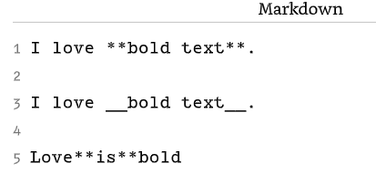

### Italic

To italicize text, add one asterisk or underscore before and after a word or phrase.

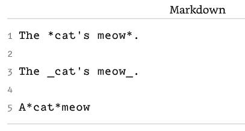

### Bold and Italic

To emphasize text with bold and italics at the same time, add three asterisks or inderscores vefore and after a word or phrase

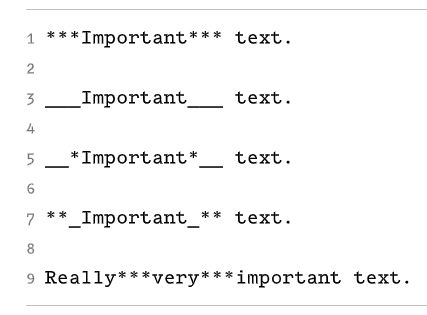

### Blockquotes

>To create a blockquote, add > in front of a paragraph

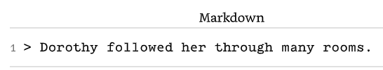

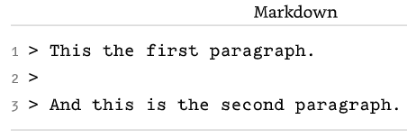

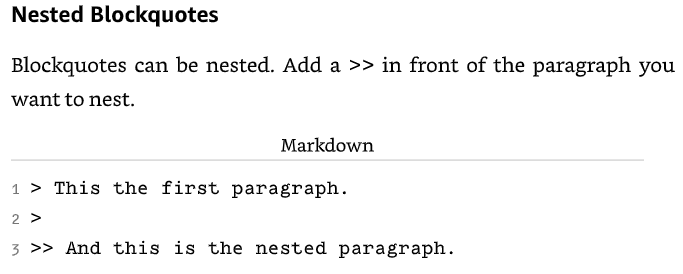

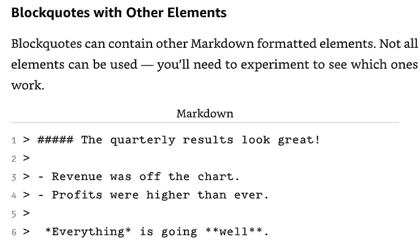

## List

You can organize items into ordered and unordered lists.

### Ordered list

To create an ordered list, add line items with numbers followed by periods.

1. First item
2. Second item
    1. indented item
    
### Unordered Lists

To create an unordered list, add dashes (-), asterisks (*), or plus signs (+) in front of line items  

- First item
- Second item

* First item
* Second item

+ First item
* Second item

- Third item
+ Fourth item

### Code blocks

Code blocks ate normally indented four spaces or one tab. when they're in a list, indent them eight spaces or two tabs.

1. Open the file
2. Find the following code block on line 21:
   
        <html>
            <head>
                <title>Test</title>
            </head>
3. Update the title to match the name of your website

   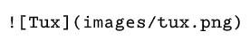

## Code

To denote a word or phrase as code, enclose it in backticks (').

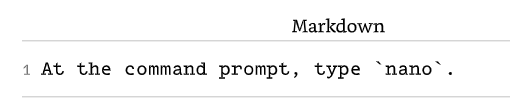

## Escaping Backticks

if the word or phrase you want to denote as code includes one or more backticks, can escape it by enclosing the word or phrase in double backticks.

``Use `code` in your Markdown file.``

## Code Blocks

To create code blocks, indent every line of the block by at least four spaces or one tab.

    <html>
        <head>
        </head>
    </html>

## Horizontal rules

To create a horizontal rule, use three or more asterisks (***), dashes (---), or underscores (___) on a line by themselves.

***

---

___________________

## Links

To create a linkm, enclose the link in brackets (e.g., [Duck Duck Go]) and then follow it immediatley with the URL in parentheses (e.g., (https://duckduckgo.com)).

Use <a href="https://duckduckgo.com"> Duck Duck Go </a>

Use <a href="https://duckduckgo.com" title="My search engine!"> Duck Duck Go </a>

## URLs and Email Addresses

To quickly turn a URL or email address into a link, enclose it in angle brackets.

<a  href="https://eff.org">https://eff.org </a>

<a  href="mailto:fake@example.com">fake@example.com </a>

## Formatting Links

To emphasize links, add asterisks before and after the brackets and parentheses. To denote links as code, add backticks in the brackets.

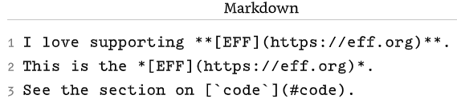

# Reference-style Links

Reference-style links are a special kind if link that make URLs easier to display and read in Markdown. Are constructed in 2 parts: the part  
you keep inline with your text and the part you store somewhere else in the file to keep the text easy to read.

## Formatting the First Part of the Link 

Thr first part of a reference-style link is formatted with two sets of brackets. The first set of brackets surrounds the text that should appear linked.  
the second set of brackets displays a label used to point to the link you're storing elsewhere in your document.

* [hobbit-hole][1]
* [hobbit-hole][a]

## Formatting the Second Part of the link

The seconds part of a reference-style link is formatted with the following attributes:

1. The label, in brackets, followed immediately by a colon and at least one space (e.g., [label]:)
2. The URL for the link, which you can optionally enclose in angle brackets.
3. The optional title for the link, ehich you can enclose in double quotes, single quotes, parenteses.

[1]: <https://en.wikipedia.org/wiki/hobbbit#lifestyle> "Hobbit lifestyles"
[a]: <https://en.wikipedia.org/wiki/hobbbit#lifestyle> "Hobbit lifestyles"

#Escaping Characters

To display a literal character that would otherwise be used to format text in a Markdown document, add a backslash (\) in front of the character.

\* Without the backslaskh, this would be a bullet in an unordered list.  

# Tables

Align with colon

| Syntax | Description |
| ------ | :-----------: |
| Header | Title       |
| Paragraph | Text     |

| 321321321 | 2 32321 |   |   |   |
|-----------|---------|---|---|---|
|           |         |   |   |   |
|           |         |   |   |   |
|           |         |   |   |   |

# Fenced Code Blocks

Syntax highlight specify a language next to the backtricks before the fenced code block.

```json
{
   "firstName": "John",
   "lastName": "Smith",
   "age": 25
}
```
# Footnotes

Here's a simple footnote, [^1] and here's a longer one. [^bignote]

[^1]: This is the first footnote.

# Definition list

First Term  
: This is the definition of the first term.

Second Term  
: This is one definition of the second term.
: This is another definition of the second term.

# Task List

- [X] Write the press release
- [ ] Update the website
- [ ] Contact the media

# Emojis

😀 😃 😄  

https://en.wikipedia.org/wiki/Main_Page


